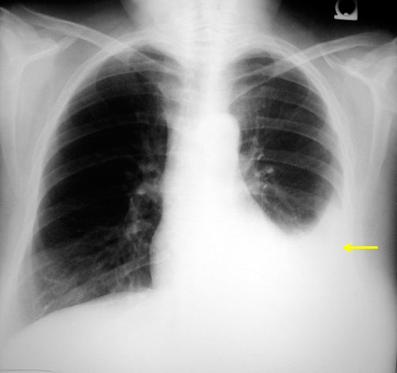

## What the code include?
* If you want to train yourself from scratch, we provide training and test the footwork code. In addition, we provide complete training courses
* If you want to use our model in your method, we provide **a best single network pre-training model,** and you can get the network code in the code

### Train the model by yourself

* Data preparation
> We gave you the example file, which is in the folder `config/train.csv`
> You can follow it and write its path to `config/example.json`

* If you want to train the model,please run the command. (We use 4 1080Ti for training, so larger than 4 gpus is recommended）:
> `pip install -r requirements.txt`
> 
> `python Chexpert/bin/train.py Chexpert/config/example.json logdir --num_workers 8 --device_ids "0,1,2,3"`

* If you want to test your model, please run the command:
> `cd logdir/`

* Cuz we set "save_top_k": 3 in the `config/example.json`, so we may have got 3 models for ensemble here. So you should do as below:
> `cp best1.ckpt best.ckpt`
> 
> `python classification/bin/test.py`

* If you want to plot the roc figure and get the AUC, please run the command
> `python classification/bin/roc.py plotname`

 * *How about drink a cup of coffee?*
> you can run the command like this. Then you can have a cup of caffe.(log will be written down on the disk)
`python Chexpert/bin/train.py Chexpert/config/example.json logdir --num_workers 8 --device_ids "0,1,2,3" --logtofile True &`

### train the model with pre-trained weights
* We provide one pre-trained model here: `config/pre_train.pth`
we test it on 200 patients dataset, got the **AUC** as below:

|Cardiomegaly|Edema|Consolidation|Atelectasis|Pleural_Effusion|
|---------|-----|---|----|-----|
|0.8703|0.9436|0.9334|0.9029|0.9166|

* You can train the model with pre-trained weights, run the command as below:

> `python Chexpert/bin/train.py Chexpert/config/example.json logdir --num_workers 8 --device_ids "0,1,2,3" --pre_train "Chexpert/config/pre_train.pth" `

### Plot heatmap using trained model

* Currently supported global_pool options in `/config/example.json` to plot heatmaps

|global_pool|Support|
|------|-----|
|MAX|Yes|
|AVG|Yes|
|EXP|Yes|
|LSE|Yes|
|LINEAR|Yes|
|PCAM|Yes|
|AVG_MAX|No|
|AVG_MAX_LSE|No|

* We also provide heatmap comparision here, including AVG, [LSE](https://arxiv.org/abs/1705.02315), and our own [PCAM](https://arxiv.org/abs/2005.14480) pooling.

<table>
  <tr>
    <td> </td>
		<td>  &nbsp;&nbsp;&nbsp;&nbsp;&nbsp;&nbsp;&nbsp;&nbsp;&nbsp;&nbsp;&nbsp;&nbsp;&nbsp;&nbsp;original&nbsp;&nbsp;&nbsp;&nbsp;&nbsp;&nbsp;&nbsp;&nbsp;&nbsp;&nbsp;&nbsp;&nbsp;&nbsp;&nbsp; </td>
		<td><a  href="config/example_AVG.json">AVG (dev mAUC:0.895)</a></td>
    <td><a  href="config/example_LSE.json">LSE (dev mAUC:0.896)</a></td>
    <td><a   href="config/example_PCAM.json">PCAM (dev mAUC:0.896)</a></td>
	<tr>
  <tr>
    <td>Cardiomegaly </td>
		<td colspan="4"></td>
	<tr>
  <tr>
    <td>Atelectasis </td>
		<td colspan="4"></td>
        <tr>
    <td>Pleural Effusion </td>
		<td colspan="4"></td>
           <tr>
    <td>Consolidation </td>
		<td colspan="4"></td>
</table>

* You can plot heatmaps using command as below:

> `python Chexpert/bin/heatmap.py logdir/best1.ckpt logdir/cfg.json CheXper_valid.txt logdir/heatmap_Cardiomegaly/ --device_ids '0' --prefix 'Cardiomegaly'`

> Where the `CheXper_valid.txt` contains lines of jpg path 

### About [PCAM](https://arxiv.org/abs/2005.14480) pooling

* PCAM Overview:

* If you think PCAM is a good way to generate heatmaps, you can cite our article like this:

### Citation

    @misc{ye2020weakly,
        title={Weakly Supervised Lesion Localization With Probabilistic-CAM Pooling},
        author={Wenwu Ye and Jin Yao and Hui Xue and Yi Li},
        year={2020},
        eprint={2005.14480},
        archivePrefix={arXiv},
        primaryClass={cs.CV}
    }

### Contact
* If you have any quesions, please post it on github issues or email at coolver@sina.com

### Reference
* [https://stanfordmlgroup.github.io/competitions/chexpert/](https://stanfordmlgroup.github.io/competitions/chexpert/)
* [http://www.jfhealthcare.com/](http://www.jfhealthcare.com/)

